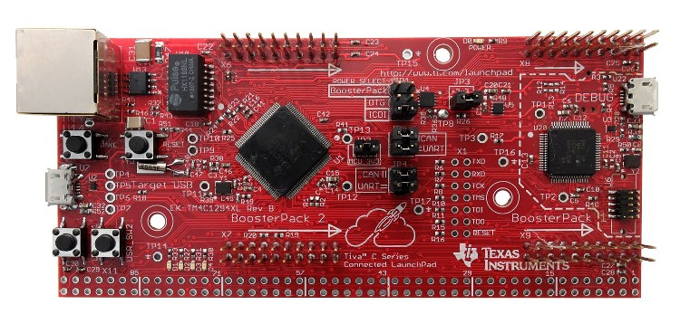
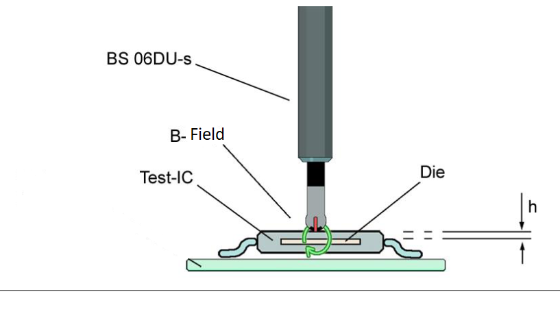
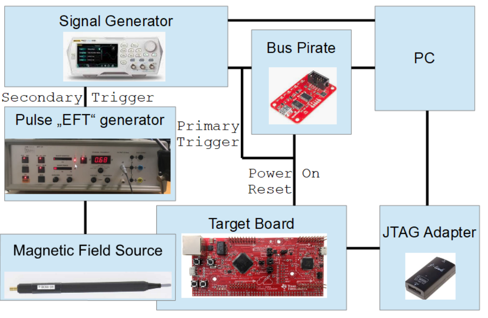
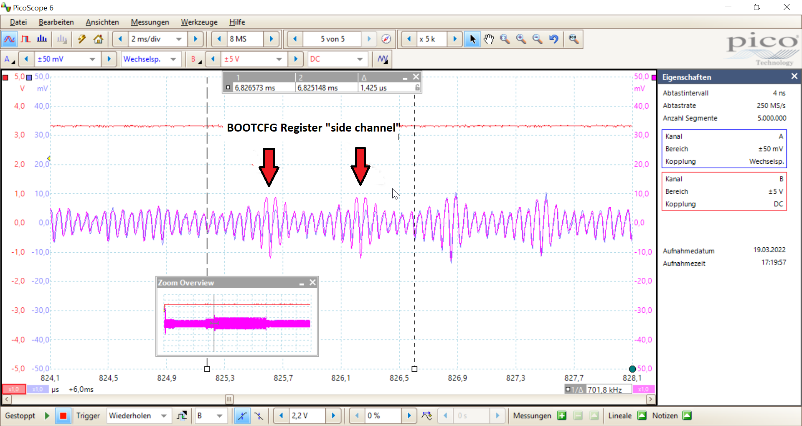
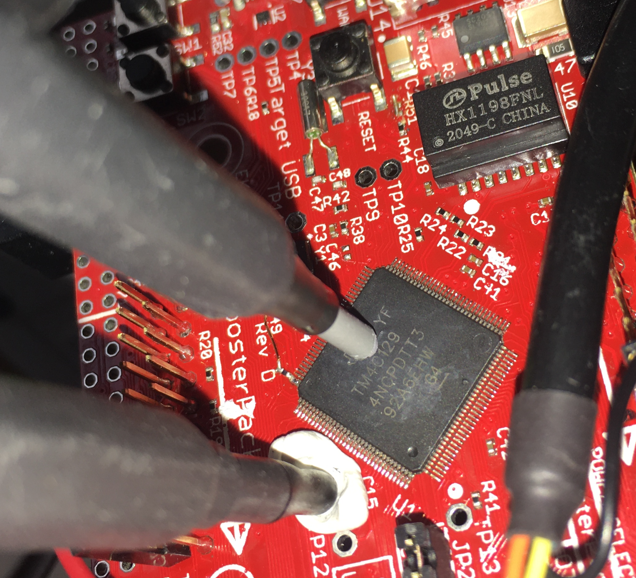
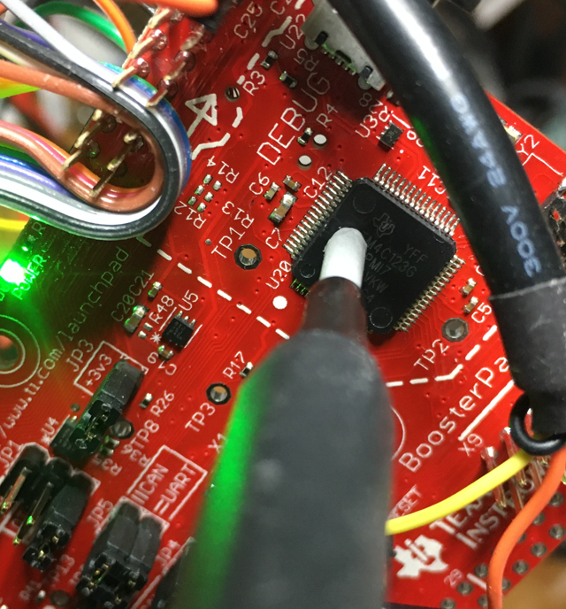
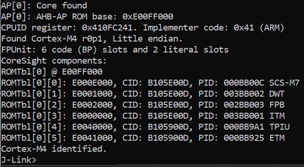

This is a description of a successful JTAG resurrection attack with electromagnetic fault injection (EM-FI) on the Texas Instrument [TM4C12x microcontroller family](https://www.ti.com/microcontrollers-mcus-processors/arm-based-microcontrollers/arm-cortex-m4-mcus/overview.html).

# The actors

## Victim: TM4C12x microcontroller
...or better said, the TM4C12x JTAG disabling mechanism. This ARM cortex M4 based microcontroller has an embedded flash memory and a mechanism to secure JTAG access. More can be found in the [datasheet](https://www.ti.com/lit/ds/symlink/tm4c129encpdt.pdf). Depending on some parameters like flash protection, JTAG access enables an attacker to extract and debug the firmware. Therefore, JTAG is normally disabled in production devices.
Here is how JTAG can be disabled in the TM4C12x:
> Permanently Disabling Debug: For extremely sensitive applications, the debug interface to the processor and peripherals can be permanently disabled, blocking all accesses to the device through the JTAG or SWD interfaces.With the debug interface disabled, it is still possible to perform standard IEEE instructions (such as boundary scan operations),but access to the processor and peripherals is blocked.The DBG0 and DBG1 bits of the Boot Configuration (BOOTCFG) register control whether the debug interface is turned on or off.The debug interface should not be permanently disabled without providing some mechanism, such as the boot loader, to provide customer-installable updates or bug fixes. Disabling the debug interface is permanent and cannot be reversed.

There is also a mechanism to **unlock** the device - but this has a price: in this case the flash memory is completely erased.

During each boot time, the BOOTCFG register is read out and JTAG protection is activated. If an attacker can induce some internal faults during this time and change some branches, JTAG may be left unprotected - so the rough idea.  

The EK-TM4C1294XL evaluation kit featuring a TCM4C129 (left) and a TM4C123 (right) is perfect as a target (I bricked two of them):

## Attacker: Electromagnetic Fault Injection
Roughly said, by generating a transient magnetic field near the device, some current is induced in the internal device wires and **may** produce some interesting faults. This picture explains the coupling mechanism:

I'm using an old, modified [EFT](https://transientspecialists.com/blogs/blog/electrical-fast-transient-burst-iec-61000-4-4) *Electrical Fast Transient* generator normally used in EMC tests, combined with a [Langer EMV BS 06DB magnetic field source](https://www.langer-emv.de/de/product/eft-einkopplung/55/h4-ic-set-eft-burst-magnetfeldquelle/429/bs-06db-s-eft-burst-magnetfeldquelle/430) and a signal generator used as programmable delay generator. I had to modify the EFT generator by adding an external, jitter-free trigger input: we need a precise, reproducible *timing*.

Since the fault has to be generated at boot time, the RESET signal of the microcontroller is used as **primary** trigger. This primary trigger is generated by a [Bus Pirate](http://dangerousprototypes.com/docs/Bus_Pirate) controlled by a PC. The primary trigger is also connected to the external input of our signal generator, which generates a **secondary** trigger after a programmable delay T to trigger the EFT generator - i.e. the pulse. The target device is connected via a [J-Link](https://www.segger.com/products/debug-probes/j-link/) JTAG adapter to a PC which orchestrates the setup. Here is the sequence:

1. Program the signal generator with a timing T
2. Trigger the signal generator (i.e. generate the RESET signal and secondary trigger for the pulse generator) via the Bus Pirate
3. Test the JTAG connection. If JTAG is available then stop (and cry), otherwise go to 1.

Here is a block diagram of the setup:

The *placement* of the probe over the chip is also a critical parameter. An automatic XY-Table can do the job (would be nice to have), manual placement is possible too.

Last but not least, the *amplitude and polarity* of the pulse have to be chosen. Normally, interesting faults appear at the boarder between "no fault at all" and "global reset".

# Scenario

## Act I: Find the correct parameters

The determination of the physical parameters is the most crucial part of the attack. Following parameters are needed:
* Timing 
* Probe placement
* Pulse amplitude and polarity

Here is a method how to find the timing (the most difficult one) for such an EM-FI attack:
1. Take a device with JTAG *enabled* and measure the current consumption (also called *side channel*) during boot.
2. Take a device with JTAG *disabled* and do the same
3. Compare the waveform to find the correct timing.

Here is a screenshot of the waveform for the two different cases:

Note that the reproducibility of the attack will suffer from the clock jitter (the device boots most probably with an internal RC-Oscillator).

The current consumption has been measured with a magnetic field probe placed near a capacitor on the board.

For the other parameters, "educated guess" combined with manual work was needed. The pulse amplitude has been set to +750 V for a succesful attack.

Once the approximate parameter set has been defined, a parameter "brute force" automatic search can be started.

## Act II: Boom

After some long hours, I was eventually able to re-enable (resurrect) the JTAG on the two ICs in a reproducible way. Here is a picture of the magnetic field probe on the TM4C129 (the second probe is a magnetic field probe to measure the current consumption alias *side channel* near an external decoupling capacitor):

And here on the TM4C123:

And this is what happens when JTAG is resurrected:

#  Disclosure

I disclosed my finding to Texas Instrument last year. They answered with [this document](https://www.ti.com/lit/ml/swra739/swra739.pdf). For the TM4C12x, there is no claim to be secure against such attacks.
